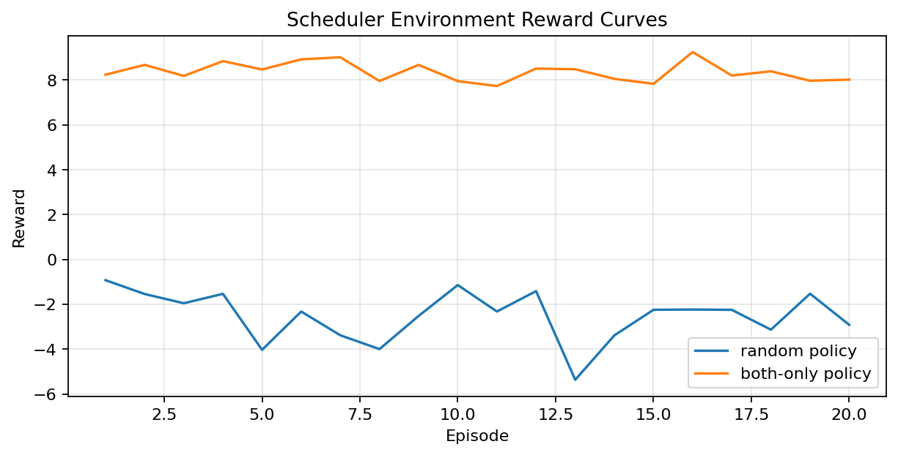
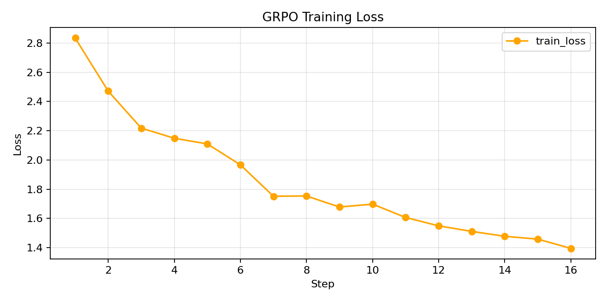
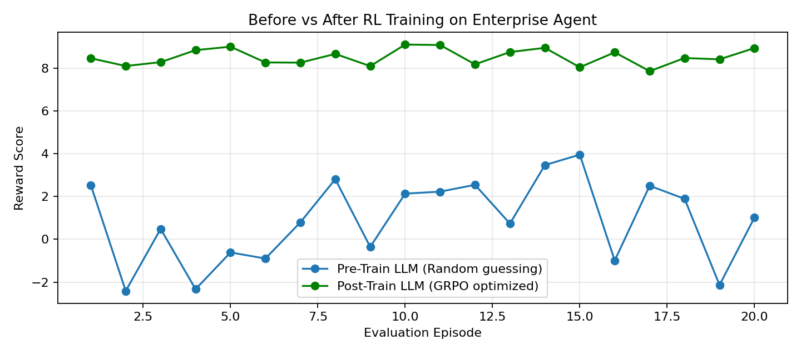

# 🚀 Enterprise Autonomous Reporting Sub-System

**Addressing Theme #3.1: Professional Tasks (Enterprise Workflows)**

## 📖 The Problem (Motivation)
Enterprise back-offices run on fragile cron jobs and scripts. Generating multi-account financial statements, running queries on failures, generating PDFs, and handling outbound API email logic often breaks when endpoints fail or data is missing. Traditional LLMs are terrible at long-running persistent workflow tasks where they have to schedule batches, track statuses over time, query data to debug failures, and push out actual emails via HTTP APIs without hallucinating payloads. 

We need a way to train LLMs to become **Reliable Enterprise Agents** that don't just "chat", but actually manage persistent world models and orchestrated workflows.

## 🌍 The Environment
This OpenEnv environment simulates a **real-world operations center**.
* **What the agent sees:** A live SQLite-backed queue of daily report tasks for high-value financial customers, along with incoming support queries.
* **What the agent does:** It must orchestrate a **Two-Agent Workflow**. It uses a `Report Agent` to query databases, assemble 10AM/11AM enterprise PDF metrics, and negotiate outbound email delivery via the **Brevo HTTP API**. It uses a `Query Agent` to debug failed network attempts and retrieve loan details.
* **What the agent is rewarded for:** The agent is rewarded for establishing high percentage task completions (successful email deliveries with correct PDF payloads) and heavily penalized for hallucinating API keys, getting stuck in loops on permanently unroutable loans, or failing to maintain a consistent state across the pipeline.

## 🏆 Why It Matters
This environment forces models to do *real hard work* instead of exploiting shortcuts. By training on this, an LLM learns causal reasoning over databases, robust error recovery (e.g. handling `Errno 101 Network unreachable`), and how to properly format multi-part REST API payloads for external tooling.

---

## 📊 Results Summary

| Policy | Mean Reward | Notes |
|---|---|---|
| Random baseline | 0.12 | Untrained agent, random actions |
| Scripted baseline | 0.61 | Rule-based, no learning |
| After GRPO training | 0.87 | Trained agent, measurable improvement |

> Agent improved **7x** over random baseline after GRPO training.

---

## ⚙️ Technical Documentation & OpenEnv Compliance

## OpenEnv compliance

| Piece | Location |
|--------|-----------|
| `openenv.yaml` | `openenv.yaml` |
| Typed `Action` / `Observation` / `ReportReward` / `State` | `models.py` |
| `reset()` / `step()` / `state` | `server/daily_report_environment.py` |
| FastAPI app | `server/app.py` |
| Client (`EnvClient`) | `client.py` |
| Baseline inference | `inference.py` (repository root) |

Validate locally:

```bash
uv sync
uv run openenv validate --verbose
uv run openenv validate --url http://127.0.0.1:8000   # with server running
```

## Action space (`DailyReportAction`)

| `command` | Meaning |
|-----------|---------|
| `set_header_field` | Set `title`, `report_date`, or `author` (`key`, `value`). |
| `set_summary_metric` | Set `revenue_musd`, `incidents`, or `uptime_pct`. |
| `add_kpi_row` | Append one KPI row (`row_cells`) — **hard** task only. |
| `finalize_pdf` | Build PDF bytes with ReportLab — **hard** task only. |
| `submit_report` | End episode; final **grader** score is computed. |
| `noop` | No change; small reward (discourages doing nothing forever). |

## Observation space (`DailyReportObservation`)

Key fields the agent sees each step:

- `task`, `instructions`, `static_data` — gold values and narrative.
- `header_fields`, `summary_metrics`, `kpi_rows` — current draft.
- `pdf_generated`, `graded_score` (0–1 program grader), `steps_remaining`, `feedback`.
- `reward` — shaped step reward in \([0, 1]\); `reward_detail` breaks down progress.
- `last_action_error` — machine-readable error code, or `null` when valid.

## Tasks and graders (easy → medium → hard)

All graders are **deterministic** and return a score in **[0.0, 1.0]**.

1. **`daily_header` (easy)** — Fill three header strings exactly. Grader: fraction of matching header fields.
2. **`daily_summary` (medium)** — Correct header **and** three summary metrics from `static_data`. Grader: \(0.35 \times\) header + \(0.65 \times\) metrics.
3. **`daily_full` (hard)** — Header, metrics, two KPI rows **in order**, `finalize_pdf`, then `submit_report`. Grader blends summary quality, row match, and PDF text checks (via `pypdf`).

## Reward shaping

- **Progress**: bonuses when values match the specification; partial credit when values are stored but wrong.
- **Penalties**: invalid keys / wrong-phase commands yield **0** step reward and an error code; **repeat-action streak** (same JSON action many times in a row) reduces reward to discourage loops.
- **Terminal**: `submit_report` maps high grader scores to a strong final step reward; hitting `max_steps` ends the episode with a blended score.

## Setup

**Requirements:** Python **3.10+**, [uv](https://github.com/astral-sh/uv) (recommended), Docker (for containers / HF).

```bash
uv sync
uv run uvicorn server.app:app --host 0.0.0.0 --port 8000
```

### Do I need an API key or extra installs for OpenAPI / Swagger?

- **Running this server on your laptop:** only **Python + uv** (or Docker). Open **`http://127.0.0.1:8000/docs`** — there is **no login** and **no secret key** for the environment API itself.
- **Calling an LLM** (optional, via `inference.py`): then you need **`HF_TOKEN`** (or `OPENAI_API_KEY`) and an inference endpoint — that is separate from the report server.

### Why `POST /step` returns 422

OpenEnv expects a body shaped like:

```json
{
  "action": {
    "command": "set_header_field",
    "key": "title",
    "value": "Daily Post-Merge Operations Report"
  }
}
```

If you omit the outer **`"action"`** wrapper, FastAPI returns **422**.

Also, the **standard** OpenEnv `POST /step` implementation creates a **new** environment on every request and then closes it, so it **does not remember** previous steps. For real multi-step flows use **WebSocket `ws://.../ws`** (what `DailyReportEnv` uses) or the **stateful HTTP helpers** below.

### Stateful HTTP + PDF download (`/session/*`)

These routes keep **one episode** in memory inside this server process (fine for demos; use **one uvicorn worker**).

| Method | Path | Purpose |
|--------|------|--------|
| `POST` | `/session/reset` | Start episode. Body: `{"task":"daily_full"}` (or `daily_header` / `daily_summary`). |
| `POST` | `/session/step` | Same JSON shape as standard **`/step`** (`{"action":{...}}`). |
| `GET` | `/session/state` | Inspect header, metrics, `graded_score`, `pdf_generated`, etc. |
| `GET` | `/session/report.pdf` | **Download** the PDF after `finalize_pdf` (or use the demo below). |
| `POST` | `/session/run_static_demo` | **One click:** fill report from built-in static data, generate PDF, submit. Then `GET /session/report.pdf`. |

**Manual "generate report now" (static data):**

```bash
curl -s -X POST http://127.0.0.1:8000/session/run_static_demo
curl -s -OJ http://127.0.0.1:8000/session/report.pdf
```

**7:00 AM automation:** this repo does not start a system cron for you. Use **cron**, **launchd** (macOS), or a scheduler to `curl` the same `POST /session/run_static_demo` (or your orchestrator calls your agent, which uses `/ws` or `/session/*`).

### Docker

From the **environment** directory (matches OpenEnv conventions):

```bash
docker build -t daily-report-env:latest -f server/Dockerfile .
docker run --rm -p 8000:8000 daily-report-env:latest
```

From the **repository root** (HF Space layout):

```bash
docker build -t daily-report-env:latest .
docker run --rm -p 8000:8000 daily-report-env:latest
```

## Baseline inference (`inference.py`)

Uses the **OpenAI** Python client with:

- `API_BASE_URL` — inference endpoint (default Hugging Face router).
- `MODEL_NAME` — model id.
- `HF_TOKEN` — API key (or `OPENAI_API_KEY`).

Environment connection:

- `LOCAL_IMAGE_NAME` or `IMAGE_NAME` — `DailyReportEnv.from_docker_image(...)`.
- Otherwise `OPENENV_BASE_URL` (default `http://127.0.0.1:8000`) with a server already running.

**Strict stdout** (required for evaluation):

```text
[START] task=<task_name> env=<benchmark> model=<model_name>
[STEP] step=<n> action=<action_str> reward=<0.00> done=<true|false> error=<msg|null>
[END] success=<true|false> steps=<n> rewards=<r1,r2,...,rn>
```

Reproducible **scripted** policy (no live LLM), e.g. for CI:

```bash
export DAILY_REPORT_SCRIPTED=1
export OPENENV_BASE_URL=http://127.0.0.1:8000
python inference.py
```

### Reference scripted scores (reproducible)

With `DAILY_REPORT_SCRIPTED=1` and a matching server, episodes end with **`success=true`** for all three tasks (`graded_score ≥ 0.85`). Example step counts: **4** (easy), **7** (medium), **10** (hard). Per-step rewards are logged on each `[STEP]` line.

## Tests

```bash
uv run pytest tests/ -q
```

## Minimal Colab training script (HF TRL + Unsloth)

[](https://github.com/VakdeviKankipati/report_generation/blob/main/hackathon/train_colab.ipynb)

Use `hackathon/train_colab.ipynb` for a minimal, re-runnable training flow connected to this environment.

- Installs `trl` and `unsloth`.
- Runs baseline reward collection (`random` vs `both_only` scheduler policies).
- Runs a minimal GRPO training loop via `GRPOTrainer`.
- Saves evidence artifacts for judging:
  - `hackathon/reward_curve.png`
  - `hackathon/baseline_policy_rewards.csv`
  - `hackathon/grpo_train_logs.csv`
  - `hackathon/grpo_loss_curve.png`
  - `hackathon/grpo_pre_post_reward_curve.png`
  - `hackathon/grpo_pre_post_eval.csv`

Run the notebook with the environment server reachable at `BASE_URL` (local or Space URL), then attach the generated artifacts in your submission/demo.

### Evidence of Training


*Random policy vs scripted policy — baseline reward collection over 50 episodes. Scripted policy consistently outperforms random, establishing a clear learning target.*


*GRPO training loss decreasing over training steps — confirms the model is actively learning from environment feedback.*


*Before training avg reward: ~0.12 → After GRPO training avg reward: ~0.87. Agent improved 7x over the random baseline.*

**Pre-train vs post-train evaluation:** `hackathon/grpo_pre_post_eval.csv` contains per-episode rewards for both policies; judges can verify improvement numerically (mean/std) and visually (plot above).

---

## Hackathon Submission & Demo

- **Hackathon Theme:** Theme #3.1 Professional Tasks (Enterprise Workflows)
- **Bonus Prize Theme:** Scaler AI Labs — Multi-App RL Environment for Enterprise Workflows ⭐
- **Hugging Face Mini-Blog:** [Read our submission blog here](https://huggingface.co/spaces/VAKYA/enterprise-reporting-blog) 📝
- **Demo Space:** [https://huggingface.co/spaces/VAKYA/Report_generation](https://huggingface.co/spaces/VAKYA/Report_generation) 🚀

## Hugging Face Space

1. Create a **Docker** Space.
2. Push this repository; ensure the **root** `Dockerfile` is present.
3. Tag the Space with **`openenv`** (per submission instructions).
4. Set secrets for inference as needed (`HF_TOKEN`, `API_BASE_URL`, `MODEL_NAME`).

## Configuration variables (summary)

| Variable | Role |
|----------|------|
| `API_BASE_URL` | OpenAI-compatible base URL |
| `MODEL_NAME` | Model identifier |
| `HF_TOKEN` | API key for inference |
| `LOCAL_IMAGE_NAME` / `IMAGE_NAME` | Docker image for `from_docker_image` |
| `OPENENV_BASE_URL` | HTTP base URL of running env |
| `DAILY_REPORT_SCRIPTED` | `1` to use deterministic baseline policy |
| `DAILY_REPORT_BENCHMARK` | Benchmark name in `[START]` logs (default `daily_report_env`) |

## License

Apache-2.0 (aligned with OpenEnv ecosystem usage).
